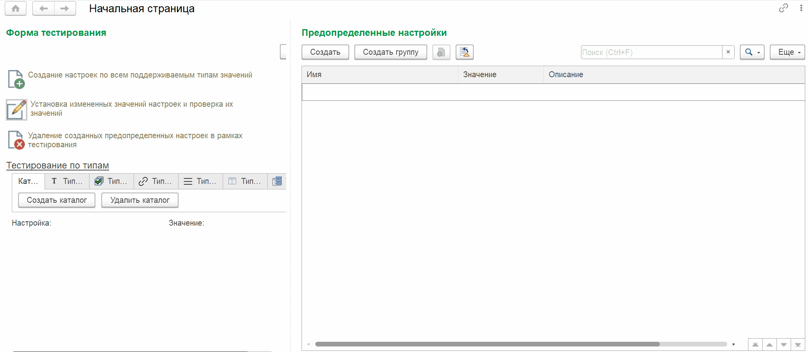
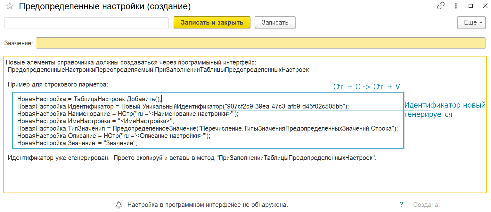
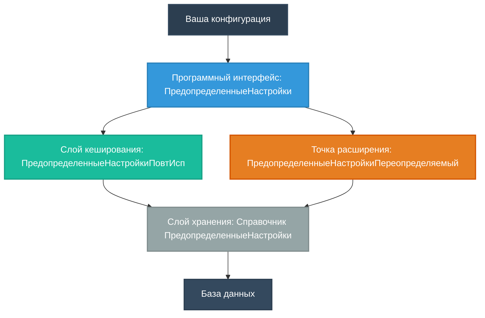

# 1С:Подсистема предопределенных значений

[](https://opensource.org/licenses/MIT)
[](https://v8.1c.ru/)
[](https://github.com/fedortimokhov/1cPredefinedValuesSubsystem)

Подсистема для элегантного управления предопределенными настройками в конфигурациях 1С:Предприятие 8.3.

## Оглавление

- [Описание](#описание)
- [Почему эта подсистема?](#почему-эта-подсистема)
- [Когда использовать](#когда-использовать)
- [Возможности](#возможности)
- [Архитектура](#архитектура)
- [Быстрый старт](#быстрый-старт)
- [Установка](#установка)
- [Справочник по типам данных](#справочник-по-типам-данных)
- [Справочник программного интерфейса](#справочник-программного-интерфейса)
- [Сценарии использования](#сценарии-использования)
- [Best Practices](#best-practices)
- [Продвинутые техники](#продвинутые-техники)
- [Тестирование](#тестирование)
- [Решение проблем](#решение-проблем)
- [Лицензия](#лицензия)

## Описание

Подсистема для управления предопределенными настройками в конфигурациях 1С:Предприятие 8.3.

**Версия:** 1.0.0  
**Совместимость:** 1С:Предприятие 8.3.25+  
**Язык:** Русский

### Введение



Данная подсистема создана в виде минималистичного набора объектов, предназначенная для очень простой интеграции в любые конфигурации на проектной работе.

Основной плюс это простота и наличие, помимо программного интерфейса еще и пользовательского.

Программное создание настроек реализовано для минимизации количества реструктуризаций.

- **7 типов данных**: Строка, Булево, Дата, Ссылка, Массив, Ключ-Значение, Таблица значений
- **Иерархическая структура**: Группировка настроек через родительские элементы
- **Автоматическое создание**: Настройки создаются программно с уникальными идентификаторами
- **Кеширование**: Быстрый доступ благодаря повторно используемым значениям
- **Типобезопасность**: Автоматическое определение и валидация типов
- **Программный интерфейс**: Единый интерфейс для работы со всеми типами настроек
- **Права доступа**: Система доступа через роли

Эта подсистема решает проблему хранения и управления конфигурационными настройками в 1С. Вместо создания множества констант или регистров, вы получаете единую систему для работы с настройками любого типа данных.

Простота использования - ключевая особенность подсистемы. Достаточно одного вызова:


```bsl
ЗначениеНастройки = ПредопределенныеНастройки.Значение("ИмяНастройки");
```

Для добавления настройки можно использовать шаблон, который выводится в описании при создании нового элемента:


## Возможности

<details>
<summary><strong>Поддерживаемые типы данных</strong></summary>

1. **Строка** - текстовые значения
2. **Булево** - логические флаги
3. **Дата** - даты и время
4. **Ссылка** - ссылки на объекты конфигурации
5. **Массив** - массивы произвольных значений
6. **Ключ-Значение** - соответствия (ключ: значение)
7. **Таблица значений** - сложные структурированные данные

</details>

<details>
<summary><strong>Иерархия настроек</strong></summary>

Настройки могут иметь родительские элементы для создания логических групп:

```
Настройки интеграции
├── Токен подключения
├── URL сервиса
└── Таймаут
    ├── Таймаут подключения
    └── Таймаут чтения
```

</details>

<details>
<summary><strong>Автоматическое кеширование</strong></summary>

Подсистема использует механизм повторно используемых значений для быстрого доступа к настройкам без обращения к базе данных на каждом запросе.

</details>

## Архитектура

<details>
<summary><strong>Компоненты подсистемы</strong></summary>

Подсистема состоит из следующих компонентов:

```
ПредопределенныеЗначенияПодсистема
│
├── 📁 Справочники
│   └── ПредопределенныеНастройки
│       ├── Реквизиты: ИмяНастройки, ТипЗначения, Значение, Хранилище
│       ├── Форма списка
│       └── Форма элемента
│
├── 📁 Общие модули
│   ├── ПредопределенныеНастройки (основной программный интерфейс)
│   ├── ПредопределенныеНастройкиПереопределяемый (точка расширения)
│   └── ПредопределенныеНастройкиПовтИсп (кеширование)
│
├── 📁 Перечисления
│   └── ТипыЗначенияПредопределенныхЗначений
│
├── 📁 Роли
│   ├── ЧтениеПредопределенныеЗначения
│   └── ДобавлениеИзменениеПредопределенныеЗначения
│
└── 📁 Обработки
    └── ПредопределенныеНастройкиТестирование
```

</details>

<details>
<summary><strong>Структура справочника</strong></summary>

Справочник `ПредопределенныеНастройки` содержит следующие реквизиты:

- **ИмяНастройки** (Строка, 100) - уникальное имя настройки для поиска
- **ТипЗначения** (Перечисление) - тип хранимого значения
- **Значение** (Любое) - значение настройки для простых типов
- **Хранилище** (ValueStorage) - для сложных типов (массив, таблица, соответствие)
- **Описание** (Строка, 1024) - описание назначения настройки
- **ДатаСоздания** (Дата) - дата создания настройки
- **Наименование** (стандартный) - наименование настройки
- **Родитель** - для создания иерархии

</details>

<details>
<summary><strong>Архитектурные диаграммы</strong></summary>

Схема ниже показывает взаимодействие компонентов:



Поток работы с настройками:

```mermaid
sequenceDiagram
    participant Dev as Разработчик
    participant API as ПредопределенныеНастройки
    participant Cache as Кеш
    participant DB as База данных
    
    activate Dev
    Dev->>+API: Определение настроек
    Note right of API: Вызов ПриЗаполненииТаблицыПредопределенныхНастроек
    API->>+DB: Создание настроек с UUID
    DB-->>-API: Подтверждение
    API-->>-Dev
    
    Dev->>+API: Получение значения
    API->>+Cache: Поиск в кеше
    alt Найдено в кеше
        Cache-->>-API: Возврат значения
    else Не найдено
        API->>+DB: Запрос к базе
        DB-->>-API: Значение
        API->>Cache: Сохранение в кеш
        Cache-->>API: Кешировано
    end
    API-->>-Dev: Результат
    deactivate Dev
```

</details>

## Быстрый старт

<details>
<summary><strong>Шаг 1: Определение настроек</strong></summary>

Переопределите процедуру `ПриЗаполненииТаблицыПредопределенныхНастроек` в модуле `ПредопределенныеНастройкиПереопределяемый`:

```bsl
Процедура ПриЗаполненииТаблицыПредопределенныхНастроек(ТаблицаНастроек) Экспорт
	
	// Строковая настройка
	НоваяНастройка = ТаблицаНастроек.Добавить();
	НоваяНастройка.Идентификатор = Новый УникальныйИдентификатор("87548614-5423-299a-af9c-a08e5ca86056");
	НоваяНастройка.ИмяНастройки = "ВерсияПодсистемы";
	НоваяНастройка.Наименование = НСтр("ru ='Версия подсистемы'");
	НоваяНастройка.ТипЗначения = ПредопределенноеЗначение("Перечисление.ТипыЗначенияПредопределенныхЗначений.Строка");
	НоваяНастройка.Описание = НСтр("ru ='Информация о версии текущей подсистемы.'");
	НоваяНастройка.Значение = "1.0.0";
	
	// Булева настройка
	НоваяНастройка = ТаблицаНастроек.Добавить();
	НоваяНастройка.Идентификатор = Новый УникальныйИдентификатор("bfc480f2-023e-40d3-ab52-fecb853edf3c");
	НоваяНастройка.ИмяНастройки = "ВключеноРегистрирование";
	НоваяНастройка.Наименование = НСтр("ru ='Регистрация событий включена'");
	НоваяНастройка.ТипЗначения = ПредопределенноеЗначение("Перечисление.ТипыЗначенияПредопределенныхЗначений.Булево");
	НоваяНастройка.Описание = НСтр("ru ='Разрешает регистрацию событий в системе.'");
	НоваяНастройка.Значение = Ложь;
	
	// Настройка с массивом
	НоваяНастройка = ТаблицаНастроек.Добавить();
	НоваяНастройка.Идентификатор = Новый УникальныйИдентификатор("6f205348-2c73-46a8-98a6-851a40a12bbe");
	НоваяНастройка.ИмяНастройки = "РазрешенныеПользователи";
	НоваяНастройка.Наименование = НСтр("ru ='Разрешенные пользователи'");
	НоваяНастройка.ТипЗначения = ПредопределенноеЗначение("Перечисление.ТипыЗначенияПредопределенныхЗначений.Массив");
	
	МассивПользователей = Новый Массив;
	МассивПользователей.Добавить("Администратор");
	МассивПользователей.Добавить("Аудит");
	
	НоваяНастройка.Значение = МассивПользователей;
	
КонецПроцедуры

</details>

<details>
<summary><strong>Шаг 2: Инициализация</strong></summary>

При первом запуске создайте отсутствующие настройки:

```bsl
// В модуле приложения или при старте системы
ПредопределенныеНастройки.СоздатьОтсутствующиеПредопределенныеНастройки();

</details>

<details>
<summary><strong>Шаг 3: Использование</strong></summary>

Получение значений настроек:

```bsl
// Получение строковой настройки
Версия = ПредопределенныеНастройки.Значение("ВерсияПодсистемы");
Сообщить(Версия); // "1.0.0"

// Получение булевой настройки
Если ПредопределенныеНастройки.Значение("ВключеноРегистрирование") Тогда
	ЗарегистрироватьСобытие();
КонецЕсли;

// Получение массива
РазрешенныеПользователи = ПредопределенныеНастройки.Значение("РазрешенныеПользователи");
Для Каждого Пользователь Из РазрешенныеПользователи Цикл
	Сообщить(Пользователь);
КонецЦикла;

</details>

## Установка

### Требования

- 1С:Предприятие 8.3.19 или выше
- EDT 2023.1+ (для разработки в EDT) или Конфигуратор
- Права администратора конфигурации

### Установка через EDT

#### Шаг 1: Подготовка

1. Создайте резервную копию вашей конфигурации
2. Убедитесь, что используете EDT версии, совместимой версии

#### Шаг 2: Импорт исходников подсистемы

1. Скачайте исходники подсистемы из репозитория (папку `ПредопределенныеЗначенияПодсистема`)
2. В EDT: File → Import → General → Existing Projects into Workspace
3. Выберите папку с подсистемой `ПредопределенныеЗначенияПодсистема`
4. Выберите "Import as separate project" (не объединять сразу)

#### Шаг 3: Сравнение и объединение конфигураций

1. Откройте вашу основную конфигурацию в EDT
2. Правой кнопкой мыши на конфигурации → Сравнить/объединить
3. Выберите проект подсистемы `ПредопределенныеЗначенияПодсистема`
4. В окне сравнения:
   - Просмотрите добавляемые объекты (справочник, модули, роли)
   - Проверьте конфликты (если есть объекты с такими же именами)
5. Нажмите "Merge" для объединения
6. Выберите режим объединения:
   - "Copy from source" для новых объектов
   - "Three-way merge" если есть конфликты
7. Подтвердите изменения

#### Шаг 4: Проверка после объединения

- Проверьте структуру подсистем
- Убедитесь, что все модули на месте
- Проверьте роли в конфигурации

### Установка через Конфигуратор

#### Шаг 1: Подготовка

1. Создайте резервную копию информационной базы
2. Убедитесь, что находитесь в режиме "Конфигуратор"

#### Шаг 2: Сравнение и объединение конфигураций

1. Скачайте файл конфигурации подсистемы (.cf) из репозитория
2. В вашей рабочей ИБ (режим Конфигуратор):
   - Конфигурация → Сравнить, объединить с конфигурацией из файла...
3. Выберите файл конфигурации подсистемы (.cf)
4. В окне "Сравнение, объединение конфигураций" настройте объединение.

#### Шаг 3: Объединение конфигураций

1. В окне сравнения нажмите кнопку "Выполнить"
2. Режим обновления выберите: "Обновить конфигурацию базы данных"
3. При наличии конфликтов:
   - Выберите "Принять из файла" для всех объектов подсистемы
4. Подтвердите объединение
5. Дождитесь завершения процесса объединения

#### Шаг 4: Постановка на поддержку

**ВАЖНО!** При объединении, конфигурацию рекомендуется ставить на поддержку:

1. Конфигурация → Поддержка → Настройка поддержки
2. Проверьте, что конфигурация находится на поддержке

#### Шаг 5: Обновление конфигурации БД

1. Конфигурация → Обновить конфигурацию базы данных
2. Просмотрите список изменений в структуре БД
3. Нажмите "Выполнить" для применения изменений
4. Дождитесь завершения обновления

### Интеграция с БСП

Для автоматического обновления настроек при обновлении информационной базы добавьте обработчики.

#### Добавление в обработчики обновления БСП

В модуле `ОбщийМодуль.ОбновлениеИнформационнойБазы` (серверный, без контекста):

```bsl
// Процедура добавления обработчиков обновления
Процедура ДобавитьОбработчикиОбновления(Обработчики) Экспорт
	
	Обработчик = Обработчики.Добавить();
	Обработчик.Версия = "1.0.0.1";
	Обработчик.Процедура = "ОбновлениеИнформационнойБазы.ОбновитьПредопределенныеНастройки";
	Обработчик.РежимВыполнения = "Отложенно";
	Обработчик.Комментарий = НСтр("ru = 'Создание отсутствующих предопределенных настроек'");
	
КонецПроцедуры

// Процедура обновления предопределенных настроек
Процедура ОбновитьПредопределенныеНастройки() Экспорт
	
	ПредопределенныеНастройки.СоздатьОтсутствующиеПредопределенныеНастройки();
	
КонецПроцедуры
```

#### Добавление в начальное заполнение

В модуле `ОбщийМодуль.НачальноеЗаполнениеПереопределяемый`:

```bsl
// При начальном заполнении информационной базы
Процедура ПриНачальномЗаполненииЭлементов(Настройки) Экспорт
	
	Настройки.ПриДобавлении = "НачальноеЗаполнение.СоздатьПредопределенныеНастройки";
	
КонецПроцедуры
```

В модуле `ОбщийМодуль.НачальноеЗаполнение` (серверный):

```bsl
Процедура СоздатьПредопределенныеНастройки() Экспорт
	
	ПредопределенныеНастройки.СоздатьОтсутствующиеПредопределенныеНастройки();
	
КонецПроцедуры
```

#### Настройка прав доступа через профили БСП

1. Роль "ЧтениеПредопределенныеЗначения" должна включаться в базовые роли.

### Проверка установки

#### Контрольный список после установки

- [ ] Подсистема "ПредопределенныеЗначения" видна в дереве конфигурации
- [ ] Справочник "ПредопределенныеНастройки" доступен
- [ ] 3 общих модуля присутствуют
- [ ] Перечисление "ТипыЗначенияПредопределенныхЗначений" содержит 8 значений
- [ ] Обработка тестирования открывается
- [ ] Роли добавлены в систему

#### Функциональная проверка

Выполните код в консоли запросов для проверки:

```bsl
// Создание отсутствующих настроек
ПредопределенныеНастройки.СоздатьОтсутствующиеПредопределенныеНастройки();

// Проверка создания тестовой настройки
ТаблицаНастроек = ПредопределенныеНастройки.НоваяТаблицаПредопределенныхНастроек();
НоваяНастройка = ТаблицаНастроек.Добавить();
НоваяНастройка.Идентификатор = Новый УникальныйИдентификатор();
НоваяНастройка.ИмяНастройки = "ТестоваяНастройка";
НоваяНастройка.Наименование = НСтр("ru ='Настройка для тестирования'");
НоваяНастройка.ТипЗначения = ПредопределенноеЗначение("Перечисление.ТипыЗначенияПредопределенныхЗначений.Строка");
НоваяНастройка.Значение = "Тест";
ПредопределенныеНастройки.ОбновитьНастройкиВБазе(ТаблицаНастроек);

// Проверить получение
Сообщить(ПредопределенныеНастройки.Значение("ТестоваяНастройка")); // Должно вывести "Тест"
```

## Справочник по типам данных

<details>
<summary><strong>1. Строка (String)</strong></summary>

**Назначение:** Текстовые значения, конфигурационные параметры

**Пример создания:**
```bsl
НоваяНастройка = ТаблицаНастроек.Добавить();
НоваяНастройка.Идентификатор = Новый УникальныйИдентификатор("...");
НоваяНастройка.Наименование = НСтр("ru ='Адрес API системы'");
НоваяНастройка.ИмяНастройки = "URL_API";
НоваяНастройка.ТипЗначения = ПредопределенноеЗначение("Перечисление.ТипыЗначенияПредопределенныхЗначений.Строка");
НоваяНастройка.Значение = "https://api.example.com";
```

**Получение значения:**
```bsl
URLAPI = ПредопределенныеНастройки.Значение("URL_API");
// URLAPI = "https://api.example.com"
```

</details>

<details>
<summary><strong>2. Булево (Boolean)</strong></summary>

**Назначение:** Флаги включения/выключения функций

**Пример создания:**
```bsl
НоваяНастройка = ТаблицаНастроек.Добавить();
НоваяНастройка.Идентификатор = Новый УникальныйИдентификатор("...");
НоваяНастройка.Наименование = НСтр("ru ='Отладка включена'");
НоваяНастройка.ИмяНастройки = "РазрешенаОтладка";
НоваяНастройка.ТипЗначения = ПредопределенноеЗначение("Перечисление.ТипыЗначенияПредопределенныхЗначений.Булево");
НоваяНастройка.Значение = Ложь;
```

**Получение значения:**
```bsl
РазрешенаОтладка = ПредопределенныеНастройки.Значение("РазрешенаОтладка");
Если РазрешенаОтладка Тогда
	// Логика отладки
КонецЕсли;

</details>

<details>
<summary><strong>3. Дата (Date)</strong></summary>

**Назначение:** Хранение дат и времени

**Пример создания:**
```bsl
НоваяНастройка = ТаблицаНастроек.Добавить();
НоваяНастройка.Идентификатор = Новый УникальныйИдентификатор("...");
НоваяНастройка.Наименование = НСтр("ru ='Дата обновления'");
НоваяНастройка.ИмяНастройки = "ДатаОбновления";
НоваяНастройка.ТипЗначения = ПредопределенноеЗначение("Перечисление.ТипыЗначенияПредопределенныхЗначений.Дата");
НоваяНастройка.Значение = ТекущаяДата();
```

**Получение значения:**
```bsl
ДатаОбновления = ПредопределенныеНастройки.Значение("ДатаОбновления");

</details>

<details>
<summary><strong>4. Ссылка (Reference)</strong></summary>

**Назначение:** Ссылки на объекты конфигурации

**Пример создания:**
```bsl
НоваяНастройка = ТаблицаНастроек.Добавить();
НоваяНастройка.Идентификатор = Новый УникальныйИдентификатор("...");
НоваяНастройка.Наименование = НСтр("ru ='Подразделение центральное'");
НоваяНастройка.ИмяНастройки = "УмолчательноеПодразделение";
НоваяНастройка.ТипЗначения = ПредопределенноеЗначение("Перечисление.ТипыЗначенияПредопределенныхЗначений.Ссылка");
НоваяНастройка.Значение = Справочники.Подразделения.НайтиПоНаименованию("Главный офис");
```

**Получение значения:**
```bsl
УмолчательноеПодразделение = ПредопределенныеНастройки.Значение("УмолчательноеПодразделение");

</details>

<details>
<summary><strong>5. Массив (Array)</strong></summary>

**Назначение:** Списки значений произвольного типа

**Важно:** Используйте `Хранилище` вместо `Значение` для массивов!

**Пример создания:**
```bsl
НоваяНастройка = ТаблицаНастроек.Добавить();
НоваяНастройка.Идентификатор = Новый УникальныйИдентификатор("...");
НоваяНастройка.Наименование = НСтр("ru ='Приоритетные статусы'");
НоваяНастройка.ИмяНастройки = "ПриоритетныеСтатусы";
НоваяНастройка.ТипЗначения = ПредопределенноеЗначение("Перечисление.ТипыЗначенияПредопределенныхЗначений.Массив");

МассивСтатусов = Новый Массив;
МассивСтатусов.Добавить(Перечисления.СтатусыДокументов.ВРаботе);
МассивСтатусов.Добавить(Перечисления.СтатусыДокументов.НаСогласовании);

НоваяНастройка.Значение = МассивСтатусов;
```

**Получение значения:**
```bsl
ПриоритетныеСтатусы = ПредопределенныеНастройки.Значение("ПриоритетныеСтатусы");
Для Каждого Статус Из ПриоритетныеСтатусы Цикл
	Сообщить(Строка(Статус));
КонецЦикла;

</details>

<details>
<summary><strong>6. Ключ-Значение (Key-Value / Соответствие)</strong></summary>

**Назначение:** Для пары ключ-значение используется Хранилище!

**Важно:** Используйте `Хранилище` для соответствий!

**Пример создания:**
```bsl
НоваяНастройка = ТаблицаНастроек.Добавить();
НоваяНастройка.Идентификатор = Новый УникальныйИдентификатор("...");
НоваяНастройка.Наименование = НСтр("ru ='Настройки интеграции'");
НоваяНастройка.ИмяНастройки = "НастройкиИнтеграции";
НоваяНастройка.ТипЗначения = ПредопределенноеЗначение("Перечисление.ТипыЗначенияПредопределенныхЗначений.КлючЗначение");

СоответствиеНастроек = Новый Соответствие;
СоответствиеНастроек.Вставить("URL", "https://api.example.com");
СоответствиеНастроек.Вставить("Token", "secret123");
СоответствиеНастроек.Вставить("Timeout", 30);

НоваяНастройка.Значение = СоответствиеНастроек;
```

**Получение значения:**
```bsl
НастройкиИнтеграции = ПредопределенныеНастройки.Значение("НастройкиИнтеграции");
URLAPI = НастройкиИнтеграции.Получить("URL");
ВремяОжидания = НастройкиИнтеграции.Получить("Timeout");

</details>

<details>
<summary><strong>7. Таблица значений</strong></summary>

**Назначение:** Сложные структурированные данные

**Важно:** Для таблиц значений используется Хранилище!

**Пример создания:**
```bsl
НоваяНастройка = ТаблицаНастроек.Добавить();
НоваяНастройка.Идентификатор = Новый УникальныйИдентификатор("...");
НоваяНастройка.Наименование = НСтр("ru ='Правила обработки'");
НоваяНастройка.ИмяНастройки = "ПравилаОбработки";
НоваяНастройка.ТипЗначения = ПредопределенноеЗначение("Перечисление.ТипыЗначенияПредопределенныхЗначений.ТаблицаЗначений");

ТаблицаПравил = Новый ТаблицаЗначений;
ТаблицаПравил.Колонки.Добавить("ТипДокумента", Новый ОписаниеТипов("Строка", , Новый КвалификаторыСтроки(100)));
ТаблицаПравил.Колонки.Добавить("АвтоматическиПровести", Новый ОписаниеТипов("Булево"));
ТаблицаПравил.Колонки.Добавить("ТребуетсяСогласование", Новый ОписаниеТипов("Булево"));

СтрокаПравила = ТаблицаПравил.Добавить();
СтрокаПравила.ТипДокумента = "ЗаказКлиента";
СтрокаПравила.АвтоматическиПровести = Ложь;
СтрокаПравила.ТребуетсяСогласование = Истина;

НоваяНастройка.Значение = ТаблицаПравил;
```

**Получение значения:**
```bsl
ПравилаОбработки = ПредопределенныеНастройки.Значение("ПравилаОбработки");
Для Каждого Правило Из ПравилаОбработки Цикл
	Если Правило.ТребуетсяСогласование Тогда
		ОтправитьНаСогласование(Правило.ТипДокумента);
	КонецЕсли;
КонецЦикла;

</details>

<details>
<summary><strong>8. Группа настроек (Каталог)</strong></summary>

**Назначение:** Организация иерархии настроек

**Пример создания группы:**
```bsl
НоваяНастройка = ТаблицаНастроек.Добавить();
НоваяНастройка.Идентификатор = Новый УникальныйИдентификатор("...");
НоваяНастройка.Наименование = НСтр("ru ='Настройки интеграции'");
НоваяНастройка.ИмяНастройки = "НастройкиИнтеграции";
НоваяНастройка.ТипЗначения = ПредопределенноеЗначение("Перечисление.ТипыЗначенияПредопределенныхЗначений.КаталогПредопределенныхНастроек");
// Группы не имеют значения
```

**Настройки внутри группы:**
```bsl
НоваяНастройка = ТаблицаНастроек.Добавить();
НоваяНастройка.ИмяНастройкиРодителя = "НастройкиИнтеграции"; // Указание родителя
НоваяНастройка.Идентификатор = Новый УникальныйИдентификатор("...");
НоваяНастройка.Наименование = НСтр("ru ='Адрес API system'");
НоваяНастройка.ИмяНастройки = "URL_API";
НоваяНастройка.ТипЗначения = ПредопределенноеЗначение("Перечисление.ТипыЗначенияПредопределенныхЗначений.Строка");
НоваяНастройка.Значение = "https://api.example.com";

</details>

## Справочник программного интерфейса

<details>
<summary><strong>Модуль ПредопределенныеНастройки</strong></summary>

Основной модуль для работы с настройками.

#### Функция `Значение(ИмяНастройки, ВызыватьИсключение = Ложь)`

Возвращает значение предопределенной настройки по ее имени.

**Параметры:**
- `ИмяНастройки` (Строка) - имя настройки
- `ВызыватьИсключение` (Булево) - вызывать ли исключение, если настройка не найдена

**Возвращаемое значение:**
- `Произвольный` - значение настройки

**Примеры:**
```bsl
// Без исключения (вернет пустую ссылку, если не найдено)
URL = ПредопределенныеНастройки.Значение("URL_API");

// С исключением
Попытка
	Token = ПредопределенныеНастройки.Значение("API_Token", Истина);
Исключение
	Сообщить("Токен API не настроен!");
КонецПопытки;
```

#### Функция `НастройкаПоИмени(ИмяНастройки)`

Возвращает ссылку на предопределенную настройку по имени.

**Параметры:**
- `ИмяНастройки` (Строка) - имя настройки

**Возвращаемое значение:**
- `СправочникСсылка.ПредопределенныеНастройки` - ссылка на настройку

**Пример:**
```bsl
Настройка = ПредопределенныеНастройки.НастройкаПоИмени("URL_API");
Если Не ЗначениеЗаполнено(Настройка) Тогда
	СоздатьНастройку();
КонецЕсли;
```

#### Функция `НоваяТаблицаПредопределенныхНастроек()`

Возвращает новую таблицу значений с колонками для описания настроек.

**Возвращаемое значение:**
- `ТаблицаЗначений` - таблица с колонками:
  - ИмяНастройкиРодителя
  - Идентификатор
  - ИмяНастройки
  - Хранилище
  - Наименование
  - Описание
  - ТипЗначения
  - Значение
  - Удалена

**Пример:**
```bsl
ТаблицаНастроек = ПредопределенныеНастройки.НоваяТаблицаПредопределенныхНастроек();
НоваяНастройка = ТаблицаНастроек.Добавить();
// Заполнение настройки...
```

#### Процедура `СоздатьОтсутствующиеПредопределенныеНастройки(ТаблицаОписанияПредопределенныхНастроек = Неопределено)`

Создает отсутствующие предопределенные настройки в базе данных.

**Параметры:**
- `ТаблицаОписанияПредопределенныхНастроек` - таблица описаний настроек (опционально)

**Пример:**
```bsl
// При первом запуске
ПредопределенныеНастройки.СоздатьОтсутствующиеПредопределенныеНастройки();
```

#### Процедура `ОбновитьНастройкиВБазе(ТаблицаНастроекВБазе)`

Обновляет настройки в базе данных согласно переданной таблице.

**Параметры:**
- `ТаблицаНастроекВБазе` - таблица с данными для обновления

**Пример:**
```bsl
ТаблицаНастроек = ПредопределенныеНастройки.НоваяТаблицаПредопределенныхНастроек();
// Заполнение таблицы...
ПредопределенныеНастройки.ОбновитьНастройкиВБазе(ТаблицаНастроек);
```

#### Процедура `ИнициализироватьТаблицуПредопределенныхНастроек(ТаблицаОписанияПредопределенныхНастроек)`

Инициализирует таблицу предопределенных настроек.

**Параметры:**
- `ТаблицаОписанияПредопределенныхНастроек` - таблица для заполнения

**Пример:**
```bsl
ТаблицаНастроек = ПредопределенныеНастройки.НоваяТаблицаПредопределенныхНастроек();
ПредопределенныеНастройки.ИнициализироватьТаблицуПредопределенныхНастроек(ТаблицаНастроек);
```

### Модуль `ПредопределенныеНастройкиПереопределяемый`

Модуль для определения настроек вашей конфигурации.

#### Процедура `ПриЗаполненииТаблицыПредопределенныхНастроек(ТаблицаНастроек)`

Процедура для определения пользовательских настроек.

**Параметры:**
- `ТаблицаНастроек` - таблица для добавления описаний настроек

**Пример:**
```bsl
Процедура ПриЗаполненииТаблицыПредопределенныхНастроек(ТаблицаНастроек) Экспорт
	
	НоваяНастройка = ТаблицаНастроек.Добавить();
	НоваяНастройка.Идентификатор = Новый УникальныйИдентификатор("87548614-5423-299a-af9c-a08e5ca86056");
	НоваяНастройка.Наименование = НСтр("ru ='Моя настройка'");
	НоваяНастройка.ИмяНастройки = "МояНастройка";
	НоваяНастройка.ТипЗначения = ПредопределенноеЗначение("Перечисление.ТипыЗначенияПредопределенныхЗначений.Строка");
	НоваяНастройка.Значение = "Значение";
	
КонецПроцедуры

</details>

## Сценарии использования

<details>
<summary><strong>Сценарий 1: Хранение настроек интеграции</strong></summary>

**Задача:** Хранение параметров подключения к внешним сервисам

```bsl
// Определение настроек
Процедура ПриЗаполненииТаблицыПредопределенныхНастроек(ТаблицаНастроек) Экспорт
	
	НоваяНастройка = ТаблицаНастроек.Добавить();
	НоваяНастройка.Идентификатор = Новый УникальныйИдентификатор("a1b2c3d4-e5f6-...");
	НоваяНастройка.ИмяНастройки = "API_URL";
	НоваяНастройка.ТипЗначения = ПредопределенноеЗначение("Перечисление.ТипыЗначенияПредопределенныхЗначений.Строка");
	НоваяНастройка.Значение = "https://api.service.com";
	
	НоваяНастройка = ТаблицаНастроек.Добавить();
	НоваяНастройка.Идентификатор = Новый УникальныйИдентификатор("b2c3d4e5-f6g7-...");
	НоваяНастройка.ИмяНастройки = "API_Timeout";
	НоваяНастройка.ТипЗначения = ПредопределенноеЗначение("Перечисление.ТипыЗначенияПредопределенныхЗначений.Число");
	НоваяНастройка.Значение = 30;
	
КонецПроцедуры

// Использование
Процедура ВыполнитьЗапросКAPI()
	
	URLAPI = ПредопределенныеНастройки.Значение("API_URL");
	TimeoutAPI = ПредопределенныеНастройки.Значение("API_Timeout");
	
	HTTPСоединение = Новый HTTPСоединение(URLAPI, , , , TimeoutAPI);
	// Выполнение запроса...
	
КонецПроцедуры

</details>

<details>
<summary><strong>Сценарий 2: Конфигурационные справочники выбора</strong></summary>

**Задача:** Хранение списка разрешенных типов документов для выбора

```bsl
// Определение настроек
Процедура ПриЗаполненииТаблицыПредопределенныхНастроек(ТаблицаНастроек) Экспорт
	
	ТаблицаЗначений = Новый ТаблицаЗначений;
	ТаблицаЗначений.Колонки.Добавить("ТипДокумента");
	ТаблицаЗначений.Колонки.Добавить("Наименование");
	
	Строка = ТаблицаЗначений.Добавить();
	Строка.ТипДокумента = "ЗаказКлиента";
	Строка.Наименование = "Заказ клиента";
	
	Строка = ТаблицаЗначений.Добавить();
	Строка.ТипДокумента = "СчетНаОплату";
	Строка.Наименование = "Счет на оплату";
	
	НоваяНастройка = ТаблицаНастроек.Добавить();
	НоваяНастройка.Идентификатор = Новый УникальныйИдентификатор("...");
	НоваяНастройка.ИмяНастройки = "РазрешенныеДокументы";
	НоваяНастройка.ТипЗначения = ПредопределенноеЗначение("Перечисление.ТипыЗначенияПредопределенныхЗначений.ТаблицаЗначений");
	НоваяНастройка.Значение = ТаблицаЗначений;
	
КонецПроцедуры

// Использование
Функция ПроверитьРазрешенныйДокумент(ТипДокумента)
	
	РазрешенныеДокументы = ПредопределенныеНастройки.Значение("РазрешенныеДокументы");
	
	Для Каждого Строка Из РазрешенныеДокументы Цикл
		Если Строка.ТипДокумента = ТипДокумента Тогда
			Возврат Истина;
		КонецЕсли;
	КонецЦикла;
	
	Возврат Ложь;
	
КонецФункции

</details>

<details>
<summary><strong>Сценарий 3: Настройки ролей и разрешений</strong></summary>

**Задача:** Хранение прав доступа для различных ролей

```bsl
// Определение настроек
Процедура ПриЗаполненииТаблицыПредопределенныхНастроек(ТаблицаНастроек) Экспорт
	
	СоответствиеПрав = Новый Соответствие;
	СоответствиеПрав.Вставить("Администратор", Новый Массив); // Все права
	СоответствиеПрав.Вставить("Пользователь", Массив(["Чтение", "Создание"]));
	СоответствиеПрав.Вставить("Гость", Массив(["Чтение"]));
	
	НоваяНастройка = ТаблицаНастроек.Добавить();
	НоваяНастройка.Идентификатор = Новый УникальныйИдентификатор("...");
	НоваяНастройка.Наименование = НСтр("ru ='Права доступа'");
	НоваяНастройка.ИмяНастройки = "ПраваДоступа";
	НоваяНастройка.ТипЗначения = ПредопределенноеЗначение("Перечисление.ТипыЗначенияПредопределенныхЗначений.КлючЗначение");
	НоваяНастройка.Хранилище = СоответствиеПрав;
	
КонецПроцедуры

// Использование
Функция ПроверитьПраво(Роль, Право)
	
	ПраваДоступа = ПредопределенныеНастройки.Значение("ПраваДоступа");
	ПраваРоли = ПраваДоступа.Получить(Роль);
	
	Если ПраваРоли <> Неопределено Тогда
		Возврат ПраваРоли.Найти(Право) <> Неопределено;
	КонецЕсли;
	
	Возврат Ложь;
	
КонецФункции

</details>

<details>
<summary><strong>Сценарий 4: Настройки печатных форм</strong></summary>

**Задача:** Хранение параметров печатных форм (отступы, размеры, шрифты)

```bsl
// Определение настроек
Процедура ПриЗаполненииТаблицыПредопределенныхНастроек(ТаблицаНастроек) Экспорт
	
	НоваяНастройка = ТаблицаНастроек.Добавить();
	НоваяНастройка.Идентификатор = Новый УникальныйИдентификатор("...");
	НоваяНастройка.Наименование = НСтр("ru ='Отступ слева'");
	НоваяНастройка.ИмяНастройки = "ОтступЛево";
	НоваяНастройка.ТипЗначения = ПредопределенноеЗначение("Перечисление.ТипыЗначенияПредопределенныхЗначений.Число");
	НоваяНастройка.Значение = 20; // мм
	
	НоваяНастройка = ТаблицаНастроек.Добавить();
	НоваяНастройка.Идентификатор = Новый УникальныйИдентификатор("...");
	НоваяНастройка.Наименование = НСтр("ru ='Размер шрифта печатной формы'");
	НоваяНастройка.ИмяНастройки = "РазмерШрифта";
	НоваяНастройка.ТипЗначения = ПредопределенноеЗначение("Перечисление.ТипыЗначенияПредопределенныхЗначений.Число");
	НоваяНастройка.Значение = 10;
	
КонецПроцедуры

// Использование
Процедура СформироватьПечатнуюФорму()
	
	ОтступЛевый = ПредопределенныеНастройки.Значение("ОтступЛево");
	РазмерШрифта = ПредопределенныеНастройки.Значение("РазмерШрифта");
	
	// Применение настроек к форме...
	
КонецПроцедуры

</details>

## Best Practices

<details>
<summary><strong>Именование настроек</strong></summary>

- ✅ Используйте понятные имена: `API_URL`, `ВключенаОтладка`, `МаксимальноеКоличествоПопыток`
- ❌ Избегайте: `setting1`, `Настройка123`, `param`

```bsl
// ✅ Хорошо
НоваяНастройка.ИмяНастройки = "EmailАдминистратора";
НоваяНастройка.ИмяНастройки = "ВключеноПротоколирование";

// ❌ Плохо
НоваяНастройка.ИмяНастройки = "Настройка1";
НоваяНастройка.ИмяНастройки = "param";

</details>

<details>
<summary><strong>Структурирование через группы</strong></summary>

Используйте родительские элементы для логической группировки:

```bsl
// Создание группы
НоваяНастройка = ТаблицаНастроек.Добавить();
НоваяНастройка.ИмяНастройки = "НастройкиИнтеграции";
НоваяНастройка.ТипЗначения = ПредопределенноеЗначение("Перечисление.ТипыЗначенияПредопределенныхЗначений.КаталогПредопределенныхНастроек");

// Элементы группы
НоваяНастройка = ТаблицаНастроек.Добавить();
НоваяНастройка.ИмяНастройкиРодителя = "НастройкиИнтеграции";
НоваяНастройка.Наименование = НСтр("ru ='Адрес сайта'");
НоваяНастройка.ИмяНастройки = "URL_API";
НоваяНастройка.ТипЗначения = ПредопределенноеЗначение("Перечисление.ТипыЗначенияПредопределенныхЗначений.Строка");
НоваяНастройка.Значение = "https://api.example.com";

</details>

## Продвинутые техники

<details>
<summary><strong>Обновление настроек при изменении конфигурации</strong></summary>

При обновлении конфигурации настройки могут требовать миграции:

```bsl
Процедура ОбновитьНастройкиПослеОбновленияКонфигурации()
	
	ТаблицаНастроек = ПредопределенныеНастройки.НоваяТаблицаПредопределенныхНастроек();
	
	// Изменение существующей настройки
	СуществующаяНастройка = ТаблицаНастроек.Добавить();
	СуществующаяНастройка.ИмяНастройки = "СтароеИмя";
	СуществующаяНастройка.НовоеЗначение = "Новое значение";
	
	// Удаление устаревших настроек
	УстаревшаяНастройка = ТаблицаНастроек.Добавить();
	УстаревшаяНастройка.ИмяНастройки = "УстаревшаяНастройка";
	УстаревшаяНастройка.Удалена = Истина;
	
	ПредопределенныеНастройки.ОбновитьНастройкиВБазе(ТаблицаНастроек);
	
КонецПроцедуры

</details>

## Тестирование

<details>
<summary><strong>Запуск тестов</strong></summary>

Подсистема включает обработку `ПредопределенныеНастройкиТестирование` для проверки работоспособности.

1. Откройте обработку в запущенном приложении
2. Нажмите "Создать тестовые настройки"
3. Проверьте, что все настройки созданы (должен появиться зеленый индикатор)
4. Нажмите "Установить тестовые значения"
5. Проверьте корректность значений
6. Нажмите "Удалить тестовые настройки"
7. Убедитесь, что настройки удалены

</details>

## История изменений

### Version 1.0.0 (2025-01-15)

- 🎉 Первый релиз подсистемы
- Поддержка 7 типов значений
- Иерархическая структура настроек
- Система кеширования
- Программный интерфейс для работы с настройками
- Тестирование включено

## Участие в разработке

Вы можете помочь улучшить подсистему:

1. Сообщайте об ошибках в Issues
2. Предлагайте новые возможности
3. Улучшайте документацию
4. Делитесь примерами использования

## Лицензия

[MIT License](LICENSE) - Copyright (c) 2025 Fedor Timokhov

## Контакты

Автор: **Fedor Timokhov**

## Публикация

<div align="center">
<a href="https://infostart.ru/public/2513626/"></a>
</div>

<p align="center"><a href="https://infostart.ru/public/2513626/">📄 Читать публикацию</a></p>
